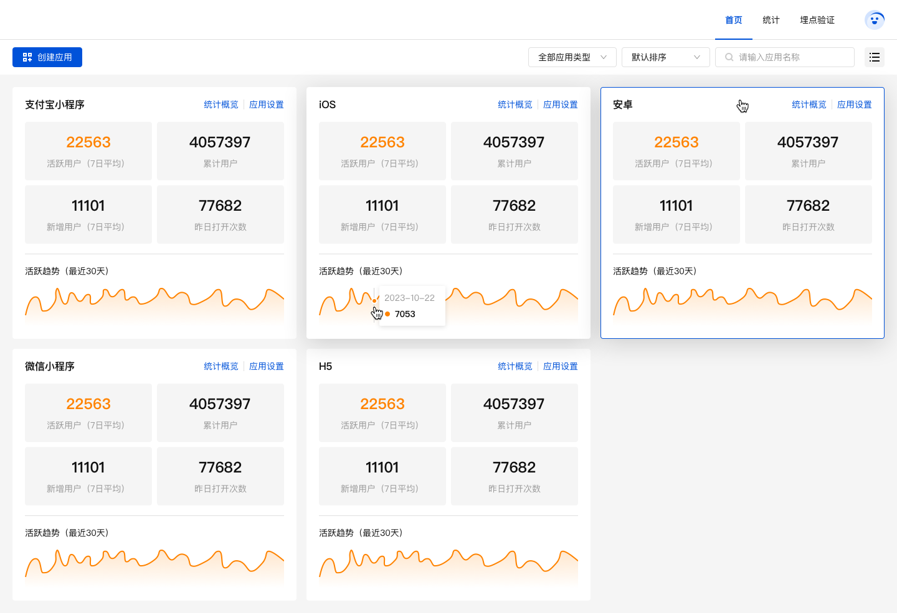
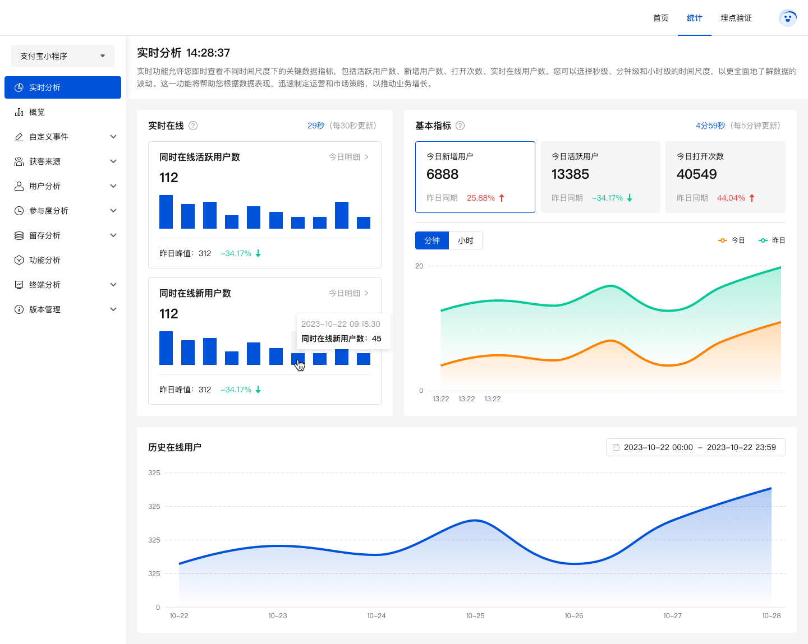
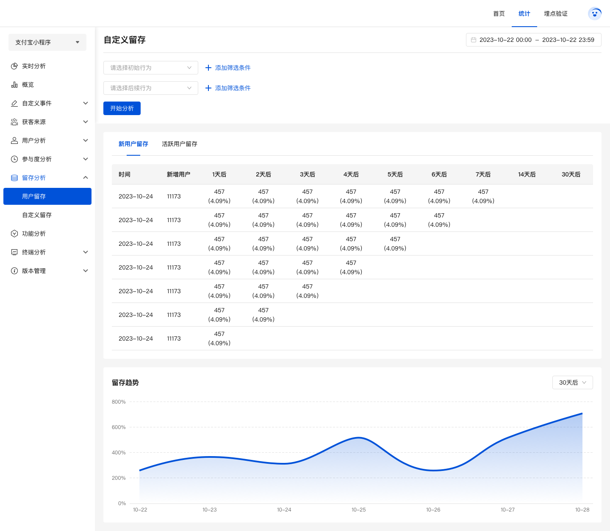
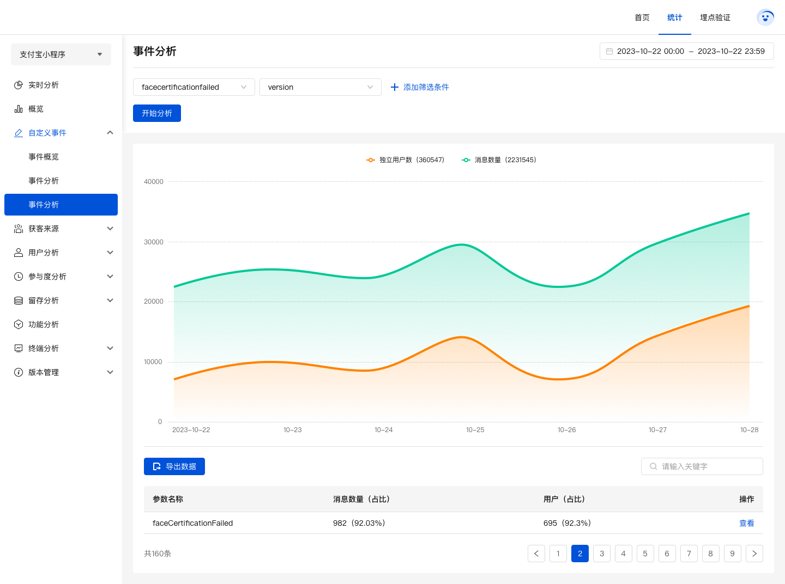

# analytics-consumer-server

基于 Nest + TypeScript 进行开发

## 联系我们

联系我们，给您最优的服务，欢迎访问 [openhn官网](https://www.openhn.com) 


## 前言

全平台（iOS、Android、小程序、web）SDK支持，极简无侵入式接入
一键私有化部署服务，数据完全掌控在您手中
支持日亿级别日志量，洞察大数据背后的秘密

## 功能

-   [x] 实时分析
-   [x] 数据概览
-   [x] 事件概览
-   [x] 事件明细
-   [x] 事件分析
-   [x] 用户统计
-   [x] 启动次数
-   [x] 用户路径
-   [x] 使用时长
-   [x] 用户留存
-   [x] 自定义留存
-   [x] 分辨率
-   [x] ...

## 安装步骤
**开发环境准备**
- Node（18.18.2)
- 采用 [scripty](https://www.npmjs.com/package/scripty) 管理本项目的所有命令。所有的命令（shell 文件）定义在 `scripts`
  文件夹下。

**开发命令**

```sh
# 初始化，拉取依赖，编译成js
npm run bootstrap

# 启动 （服务端），本地环境-配置文件 src/config/config.development.ts
npm run start

# 启动 （服务端），测试环境-配置文件 src/config/config.test.ts
npm run start:test

# 启动 （服务端），生产环境-配置文件 src/config/config.prod.ts
npm run start:prod
```

## 项目截图

### 首页



### 实时分析



### 留存



## 事件分析

